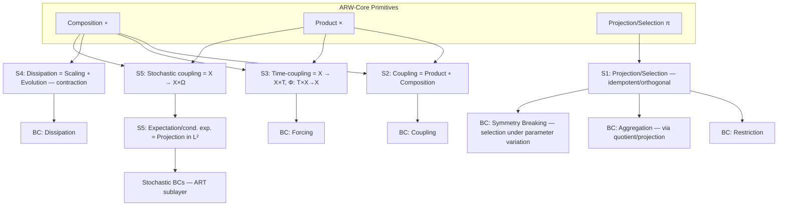

# Identical Operator Signatures Across Domains

## Executive Summary

This report investigates the hypothesis that **identical operator signatures** — recurring
patterns built from *composition*, *product formation*, and *projection/selection*, optionally
extended by quantitative operations such as scaling or expectation — appear in widely
different disciplines and play **comparable structural roles** in each. This is central to ARW
because ARW assumes that **BC classes** (Restriction, Coupling, Aggregation, Symmetry Breaking,
Forcing, Dissipation) can be understood as **semantic labels** for exactly these operator signatures.

Key findings:

- Five particularly canonical operator signatures can be robustly identified and demonstrated
  across domains:
  - **(S1) Projection / Selection** (incl. idempotent projectors, Poincaré/cross-section
    reduction, relevant/irrelevant split)
  - **(S2) Product ∘ Composition** as the signature for **Coupling / Interconnection**
  - **(S3) Time-coupled product** (extension `X ↦ X × T`) as the signature for
    **Forcing / time-variant input**
  - **(S4) Scaling ∘ Composition** as the signature for **Dissipation / Contraction / Relaxation**
  - **(S5) Expectation / conditional expectation as projection** (in particular L²-projection)
    as the signature for **stochastic coupling + reduction**
- The signatures recur in **physics (dynamics & statistical physics), control theory, quantum
  mechanics, ecology, neuroscience, machine learning, epidemiology/social systems**, and
  **category-theoretic formalisms** — sometimes in very similar mathematical form, sometimes
  as natural generalizations (e.g. tensor product instead of Cartesian product in QM).
- Implication for ARW: the recurring signatures support the ARW reading
  "**BC classes = semantic labels for operator signatures**", but also make limits visible
  (e.g. non-Cartesian products, non-commutativity, domain-specific additional operators).
- The report closes with a **validation program** (6 concrete research actions) and
  **repo artifact recommendations** (Markdown catalogs, diagrams, case templates).

---

## Framework and Method

### Operator Signature as a Domain-Neutral Structural Pattern

In the ARW operator program, (i) a **primitive operator basis** (in particular composition,
product formation, projection) and (ii) its **closure under admissible composition** are treated
as structural vocabulary. From these, **operator signatures** emerge as recurring blueprints
for many models. ARW then assigns BC classes to these signatures (e.g. Restriction ↔
Projection; Coupling ↔ Product + Composition; Forcing ↔ time coupling; Dissipation ↔
time-coupled contraction, with attractor projection as a limiting operation).

### Domain Coverage

The following domains are required and covered:

- Dynamical Systems (Physics)
- Control Engineering / Control Theory
- Statistical Physics
- Quantum Mechanics
- Ecology / Population Dynamics
- Neuroscience / Computational Neuroscience
- Machine Learning (Deep Nets, Attention)
- Social Systems / Epidemiology
- Category Theory / structural formalisms

Each signature section provides: **(1)** formal definition, **(2)** intuition,
**(3)** 3–5 cross-domain examples, **(4)** primary/standard sources.

---

## Canonical Operator Signatures with Cross-Domain Mapping

### S1 — Projection / Selection

**Formal Definition**

A projection can be formalized differently depending on the underlying structure;
two particularly canonical forms are:

- **Idempotent projector** (structural):

  ```
  p : X → X,   p ∘ p = p
  ```

  (in Hilbert spaces additionally orthogonal: `P = P*` and `P² = P`)

- **Projections from product structures** (categorically):
  For a product `A × B`, canonical projections `π_A : A × B → A` and `π_B : A × B → B`
  exist, characterized by a **universal property**.

**Intuition**

Projection/selection stands for "**only the relevant part remains**": reduction of degrees
of freedom, restriction to admissible states (admissibility), measurement/observation, or
coarse-graining as a structural map.

**Cross-Domain Examples**

- **Quantum Mechanics (measurement as projector):** Projective measurements are described
  by projectors and measurement operators; the (selective) state update is formulated in
  a projection-like way in standard treatments (projection postulate / Lüders update in
  PVM special form).
- **Statistical Physics (Zwanzig projection "relevant/irrelevant"):** In the
  projection-operator method, a density/motion is formally split into a "relevant" part
  (for certain observables) and an orthogonal remainder; this is explicitly constructed
  as a Projection Operator.
- **Dynamical Systems (Poincaré section & First-Return Map as dimension reduction):**
  A flow `φ(t,x)` is reduced via a section `Σ` to a return map; this is a projection of
  continuous dynamics onto a discrete, low-dimensional structure.
- **Machine Learning (PCA as linear projection):** PCA reduces dimensions by projecting
  data linearly onto a subspace that minimizes reconstruction error — a prototypical
  projection-operator use case in data / feature spaces.
- **Epidemiology / Social Systems (compartmentalization as projection/aggregation step):**
  Compartment models (SIR/SEIR) replace micro-individual states with aggregated state
  variables (Susceptible/Infected/Recovered etc.). Structurally this is a
  projection/coarse-graining map from "micro" to "macro".

**Primary Sources**

- Projection operators in StatPhys: Zwanzig (1960); Mori (1965)
- Poincaré maps: MIT-OCW Notes; Tucker (definition of Poincaré map)
- PCA: Jolliffe, *Principal Component Analysis* (standard text)
- QM measurement: von Neumann (1932) as classical origin; modern standard treatment:
  Nielsen & Chuang, chapter on projective measurement

---

### S2 — Product ∘ Composition (Coupling Signature)

**Formal Definition**

A core form is the construction of a **joint state space** via a product and a map that
"mixes" dependencies:

- State-space coupling:

  ```
  X_joint = X₁ × X₂
  F : X₁ × X₂ → X₁ × X₂
  F(x₁, x₂) = (f(x₁, x₂), g(x₁, x₂))
  ```

- Categorically, coupling is described via product + pairing + composition
  (e.g. `⟨f, g⟩` and `∘`).

**QM note:** In quantum mechanics the product of composite systems is the **tensor product**,
and central structures are non-commutative. The structural role "couple subsystems" is
preserved, but the primitive `×` must be generalized to `⊗` for native QM coverage.
→ See `docs/advanced/quantum_operator_extension.md` (planned).

**Intuition**

"**Multiple degrees of freedom are guided jointly**": subsystems are merged into a common
system and the dynamics/map contains genuine dependencies between the factors.

**Cross-Domain Examples**

- **Control Theory (feedback interconnection):** Connecting "plant" and "controller" is
  structurally a product of subsystem states plus composition via feedback — formulated
  as a fundamental structural principle in standard treatments.
- **Statistical Physics (Ising coupling):** An Ising state is a configuration of many spins
  (product-like configuration space); the energy contains coupling terms between spins —
  a prototypical product-plus-interaction pattern.
- **Quantum Mechanics (composite systems via tensor product):** Composite quantum systems
  are built via tensor products; operations on the total system act on the product object,
  but the product structure is monoidal (tensor) rather than Cartesian. The structural role
  "couple subsystems" is preserved.
- **Ecology / Population Dynamics (Lotka-Volterra coupling on `X × Y`):** Two populations
  `x(t), y(t)` form a product state; interaction occurs via crossed terms — classical
  source: Volterra (1926).
- **Neuroscience (coupled spiking networks):** Networks of spiking neurons are modeled as
  high-dimensional product states; synaptic coupling realizes interdependencies. A classical
  reference for such coupled dynamics is the analysis of sparsely connected E/I networks.

**Primary Sources**

- Feedback/Interconnection: Åström & Murray, *Feedback Systems* (open standard text)
- Ising (1925) original, *Z. Physik*
- Volterra (1926) original
- Spiking networks: Brunel (2000) as standard reference for coupled integrate-and-fire
  networks; Gerstner & Kistler as modeling standard
- Categorical perspective on quantum protocols (tensor in dagger-compact categories):
  Abramsky & Coecke (2004)

---

### S3 — Time-Coupled Product (Forcing Signature)

**Formal Definition**

Time coupling can be formulated structurally as a **state space extension**:

```
X ↦ X × T,   Φ : T × X → X
```

with `T = ℝ`, `T = ℤ`, or `T = S¹` (periodic). In ODE form:

```
ẋ = f(x, t)
```

corresponds to a `t`-dependent operator on `X`. In ARW terms, this is a prototypical
mechanism from which **Forcing-BC** arises as an operator chain on the extended space.

**Intuition**

An external degree of freedom (time, season, clock, sequence index) is "attached" as an
explicit dimension; the dynamics depend parametrically on this dimension.

**Cross-Domain Examples**

- **Dynamical Systems / Physics (periodic excitation & stroboscopic reduction):**
  Periodically forced systems are modeled as `f(x,t)` with periodic `t`; Poincaré maps /
  first-return maps are standard tools for analyzing such time-coupled systems.
- **Control Theory (time-variant systems & inputs):** State-space representations
  `ẋ = A(t)x + B(t)u(t)` explicitly model time-dependent coupling and time-dependent
  inputs — a standard case in control/feedback.
- **Quantum Mechanics (time-dependent Schrödinger equation / `H(t)`):** Time evolution is
  governed by the TDSE; external fields or driving appear as `H(t)`.
- **Epidemiology / Social Systems (term-time/seasonal forcing in SEIR/SIR):**
  Transmission `β(t)` is modeled as periodic or term-time switching; this produces regime
  transitions and complex dynamics in epidemic models.
- **Machine Learning (sequence index as "time dimension"; attention as coupling over token
  index):** Transformer models treat tokens as an index set; attention couples states over
  this index and can be read as "product with index set + parameterized operator
  application". The core formula (weighted summation over values after softmax weights from
  query-key compatibility) makes the index-coupling character explicit.

**Primary Sources**

- Forced / time-driven systems: dynamical systems notes and Poincaré map definitions
- Seasonal epidemics: Earn et al. (2000); Keeling (2001) as standard references for
  term-time / seasonal transmission
- QM time evolution: MIT-OCW TDSE notes
- ML Attention: Vaswani et al. (2017), *Attention Is All You Need*

---

### S4 — Scaling ∘ Composition (Dissipation / Contraction Signature)

**Formal Definition**

A robust abstract form is **contraction**: a map `F : X → X` is contractive if
(in an appropriate norm/metric)

```
‖F(x) − F(y)‖ ≤ c ‖x − y‖,   0 < c < 1
```

This can be understood as "scaling on differences". In many models this signature appears
as "damping/relaxation" (e.g. linear leak, friction) or as semigroup-like convergence
toward fixed points / attractors.

ARW emphasizes that dissipation frequently does **not** "contain a projection", but can
**asymptotically** produce a projection-like map onto attractors (limiting operation).
This is an explicit limit statement, not a finite composition law.

**Intuition**

"**Dynamics forgets details**": trajectories converge toward robust sets (fixed point,
attractor, stationary state); differences are damped.

**Cross-Domain Examples**

- **Dynamical Systems / Physics (damping in the oscillator):** Damping terms (friction/leak)
  lead to contraction in suitable coordinates and attractor structure (e.g. stable fixed
  point, limit cycle in the forced-damped system).
- **Neuroscience (Leaky Integrate-and-Fire / leak term):** The LIF equation explicitly
  contains a leak term that pulls the membrane potential back exponentially — prototypical
  dissipation/scaling of the state difference.
- **Ecology (logistic growth as self-limiting contraction-like regime):** The logistic
  equation drives populations toward saturation/steady state; historical origin:
  Verhulst (1838).
- **Quantum Mechanics (open systems: GKSL/Lindblad dynamics):** Markovian open quantum
  dynamics is described by generators of completely positive semigroups; this dynamics is
  dissipative (relaxation onto stationary states is possible) and formally given as
  semigroup evolution.
- **Machine Learning (L2 regularization / "weight decay" as shrinkage):** L2 regularization
  leads to systematic shrinkage of weights (scaling/damping component in the update),
  effectively dampening model capacity.

**Primary Sources**

- LIF formulas / leak-reset: comparison works & lecture slides
- Logistic equation: Verhulst (1838), modern commentary
- Lindblad generator: Lindblad (1976), *On the Generators of Quantum Dynamical Semigroups*
- Deep Learning regularization: Goodfellow, Bengio & Courville, *Deep Learning*,
  chapter on Regularization (L2 effect)

---

### S5 — Expectation / Conditional Expectation as Projection

**Formal Definition**

In a probability space `(Ω, F, P)` with sub-σ-algebra `G ⊆ F`, the conditional
expectation `E[X | G]` is the `G`-measurable variable that matches integrals over
`G`-events. In `L²` it is simultaneously the **orthogonal projection** onto the
subspace `L²(G)`:

```
E[ · | G]  =  Proj_{L²(G)}( · )
```

**Intuition**

"**Collapsing the stochastic dimension**": from a random object, a deterministic (or less
random) description is extracted relative to available information; the "best" quadratic
estimate equals the conditional expectation.

**Cross-Domain Examples**

- **Probability Theory (conditional expectation = orthogonal projection):** Classical theorem
  for L²-variables; explicit in standard probability notes.
- **Control / Estimation (MMSE estimator = conditional mean):** In Bayesian / filter theory,
  the conditional mean `E[x | Z_k]` minimizes the MSE — the core principle behind
  Kalman / Bayes filters under appropriate model assumptions.
- **Statistical Physics (Mori-Zwanzig: projection + conditional mean → Generalized Langevin
  Equation):** The projection-operator formalism yields effective equations for relevant
  observables with memory terms; "relevant" is typically implemented as a
  projection / expectation structure.
- **Machine Learning (attention as "discrete expectation" over values):** In Scaled
  Dot-Product Attention, the output is a weighted sum of the values; the weights
  (softmax over compatibilities) define a discrete distribution, making attention formally
  close to an expectation `∑ᵢ wᵢ vᵢ`.
- **Neuroscience (Spike-Triggered Average & inference as conditional statistics):**
  Spike-triggered methods and decoding scripts formulate stimulus-response inference via
  conditional distributions `P(x | s)` and conditional statistics; STA is a classical
  conditional summary operator in spike analysis.

**Primary Sources**

- Conditional expectation as projection: TU Berlin, Probability Theory notes
- MMSE = conditional mean: ETH Estimation Notes
- Mori-Zwanzig: Zwanzig (1960); Mori (1965); explicit application to EEG macro-models
- Attention: Vaswani et al. (2017), *Attention Is All You Need*
- Spike decoding: Paninski (2003), NeurIPS

---

## Signature × Domain Comparison Matrix

Column legend: **DS** (Dynamical Systems/Physics), **CT** (Control), **SP** (StatPhys),
**QM** (Quantum Mechanics), **ECO** (Ecology), **NEURO**, **ML**, **SOC/EPI**, **CAT** (Category Theory).

| Operator Signature | DS | CT | SP | QM | ECO | NEURO | ML | SOC/EPI | CAT |
|---|---|---|---|---|---|---|---|---|---|
| **S1 Projection/Selection** | Poincaré reduction | Output/estimation | relevant/irrelevant | measurement proj. | aggregation/state-red. | observations/STA | PCA/embedding | compartments | product projections |
| **S2 Product ∘ Composition (Coupling)** | coupled states | feedback interconnection | interactions (Ising) | tensor composite | LV coupling | networks | layer composition | multi-group models | products/pairing |
| **S3 Time-coupled product (Forcing)** | f(x,t), stroboscopy | time-variant systems | driving/NESM | H(t) | seasonal environment | stimulus input | seq. index/attention | term-time forcing | actions/monoid action |
| **S4 Scaling ∘ Composition (Dissipation)** | damping/attractor | stability/decay | relaxation/dynamics | Lindblad semigroup | logistic saturation | leak term | weight decay | forgetting/relaxation | endomorphisms/idempotency |
| **S5 Expectation as projection** | stoch. reduction | MMSE E[x\|Z] | Mori-Zwanzig GLE | measurement statistics | environmental noise | STA/decoding | attention as expectation | risk/forecasting | adjunctions/conditioning |

**Note:** Not every domain realizes every signature in exactly the same mathematical
category. The QM column is the most important case where "product" is frequently tensorial
rather than Cartesian.

---

## Structure Diagram (Mermaid)



This diagram corresponds to the ARW hypothesis chain "Primitives → Signatures → BC Classes"
as formulated in the repo as the working structure.

---

## Implications for ARW, Limits, Validation, Repo Artifacts

### Implications for ARW

**1) Support for the "BC = Signature Semantics" hypothesis**

The cross-domain findings show that the same structural operator patterns appear in very
different theories — often precisely where ARW locates its BC classes:

- Restriction ↔ Projection (QM measurement; StatPhys relevant/irrelevant; Poincaré section)
- Coupling ↔ Product ∘ Composition (feedback interconnection; Ising interaction; LV system; neural networks)
- Forcing ↔ State extension `X × T` (SEIR seasonality; TDSE; forced oscillators)
- Dissipation ↔ Contraction / semigroup relaxation (leak; Lindblad; weight decay; logistic saturation)

This directly supports the ARW claim that BC taxonomy can be understood as a **derived
classification** of recurring operator signatures.

**2) Support for the ARW-Core vs. ART-Layer stratification**

Many examples require additional quantitative operators (addition, scaling, differentiation,
integration) for "complete equations". The structural signature, however, frequently remains
reducible to ARW-Core operators (product/composition/projection), while concrete numerical
forms reside in the ART layer.

**3) Contribution to scope-limit diagnosis (F5 notion)**

When a domain requires operators that lie outside the current operator closure (e.g.
non-commutative operator algebras, tensorial monoidality, CP maps), this is a candidate for
**scope exhaustion**: the model simply cannot express the observed structure from the
assumed basis.

---

### Limits and Counterexamples

- **Non-Cartesian products in QM:** Composition + Cartesian product are very natural in
  classical modeling; in quantum mechanics the "product" of composite systems is the tensor
  product and central structures are non-commutative. This suggests that if ARW is to cover
  QM "natively", the primitive "product" should be formulated as a **monoidal product
  structure** (not necessarily Cartesian).
- **Projection semantics are not unique:** The presence of a projection suggests Restriction,
  but projections also serve as measurement operators, coarse-graining maps, estimator
  constructions, or section reductions. For ARW this means: signatures are recurring, but
  the **semantics** (which BC class) can be context-dependent and possibly non-invertible
  (ARW-Q15 problem).
- **Dissipation → Projection only asymptotically:** Many systems exhibit attractor projection
  "in the limit" but not as a finite operator composition. Therefore "Dissipation produces
  Restriction" is in general a limit/limiting statement, not a finite composition law.
- **Domain-specific operators can be irreducible:** Examples include renormalization steps
  (coarse-graining + rescaling) and generators of semigroups. While these can often be
  written as a composition of known steps, they may practically require their **own
  primitives** when admitting generalizations (e.g. infinite dimensions, topological effects).

---

### Research Actions (Validation Program)

Six concrete research actions to make the hypothesis "identical signatures across domains"
testable within the ARW repo:

**1) Signature catalog as reference object**
A Markdown catalog that formally defines each signature, names typical invariants/indicators
(idempotence, contraction rate, periodic time coupling, etc.) and links to canonical sources.
→ `docs/advanced/operator_signature_catalog.md`

**2) Cross-domain case triads (one signature, three domains each)**
Per signature, a triad of cases, e.g.:
- S3 (Forcing): forced pendulum ↔ term-time SEIR ↔ time-dependent H(t)
- S5 (Expectation): Kalman/MMSE ↔ Mori-Zwanzig ↔ attention as discrete expectation

with identical template and clear signature criteria.

**3) Invertibility experiment (operationalizing ARW-Q15)**
Define a minimal observation space Π and test when signatures and BC labels can be uniquely
inferred from data/regimes (and when overlap occurs). This directly addresses the
bidirectionality question formulated in the repo.

**4) "Quantum stress test" for the primitives**
Implement a QM case study (projective measurement + tensorial composition + Lindblad
dissipation) and check:
- Is "product" as Cartesian sufficient?
- Must "product" be generalized (monoidal/tensor)?
- Which BC labels remain stable?

**5) F5 test case: model failure through operator vocabulary**
Search for a case where a classical model collectively fails and the cause is plausibly
"operator basis insufficient" (ARW-F5 hypothesis). Candidates: non-Markovianity that
cannot be expressed without a memory operator; or non-commutativity in QM measurement chains.

**6) Empirical bridge: projection-operator methods in Neuro/EEG**
The Mori-Zwanzig methodology has been explicitly transferred to EEG macro-dynamics; this is
suitable as a "bridge case" to empirically test signature transferability (StatPhys ↔ Neuro).

---

### Recommended Repo Artifacts

| Artifact | Path | Contents |
|---|---|---|
| Signature catalog | `docs/advanced/operator_signature_catalog.md` | S1–S5 definitions, criteria, invariants, sources |
| Cross-domain matrix (extended) | `docs/advanced/cross_domain_signature_matrix.md` | Extended matrix incl. sub-signatures: quotient/coarse-graining, parameter coupling |
| Quantum operator extension | `docs/advanced/quantum_operator_extension.md` | Cartesian vs tensor product; CP maps; consequences for ARW primitives |
| Signature-first case template | `docs/cases/CASE_TEMPLATE_signature_first.md` | Blocks: state space(s) → primitive operators → derived signatures → BC labels → regime partition → observables Π / perturbations Δ / ε → failure modes |
| Mermaid signature diagram | `diagrams/arw_signature_graph.mmd` | Mermaid source of the diagram above as repo asset |
| Validation program | `docs/notes/validation_program_signatures.md` | 6 actions as roadmap incl. acceptance criteria |

---

### Prioritized Short Bibliography

(primary/authoritative sources; selected by load-bearing capacity for the signatures)

- Zwanzig (1960), *Ensemble Method in the Theory of Irreversibility* (projection operator in StatPhys)
- Mori (1965), *Transport, Collective Motion, and Brownian Motion* (projection-operator formalism)
- Åström & Murray, *Feedback Systems* (open text; interconnection/feedback as structural principle)
- Kalman (1960), *A New Approach to Linear Filtering and Prediction Problems* (filter foundation; historical)
- Durrant-Whyte, *Estimation Notes* — MMSE = E[x|Z] (conditional expectation as best estimator)
- Kermack & McKendrick (1927), *A contribution to the mathematical theory of epidemics* (SIR as macro-reduction)
- Volterra (1926), *Fluctuations in the Abundance of a Species considered Mathematically* (classical coupling dynamics)
- Brunel (2000), *Dynamics of sparsely connected networks of spiking neurons* (coupled neural networks)
- Vaswani et al. (2017), *Attention Is All You Need* (attention as weighted sum / "expectation")
- Goodfellow, Bengio & Courville, *Deep Learning* (regularization / weight decay as shrinkage)
- Lindblad (1976), *On the Generators of Quantum Dynamical Semigroups* (dissipative semigroups in QM)
- Mac Lane, *Categories for the Working Mathematician* (finite products, projections, universal properties)
- ARW repo hypothesis base (BC ↔ Signature ↔ Primitives, F5 / scope limits)

---

*Translated and adapted from: "Gleiche Operator-Signaturen in vielen Domänen" (deep-research report, 2026-03-14)*
*All `citeturn` / `filecite` search artifacts removed. Verified against: arw-repo-context SKILL, arw-meta-guard SKILL.*
