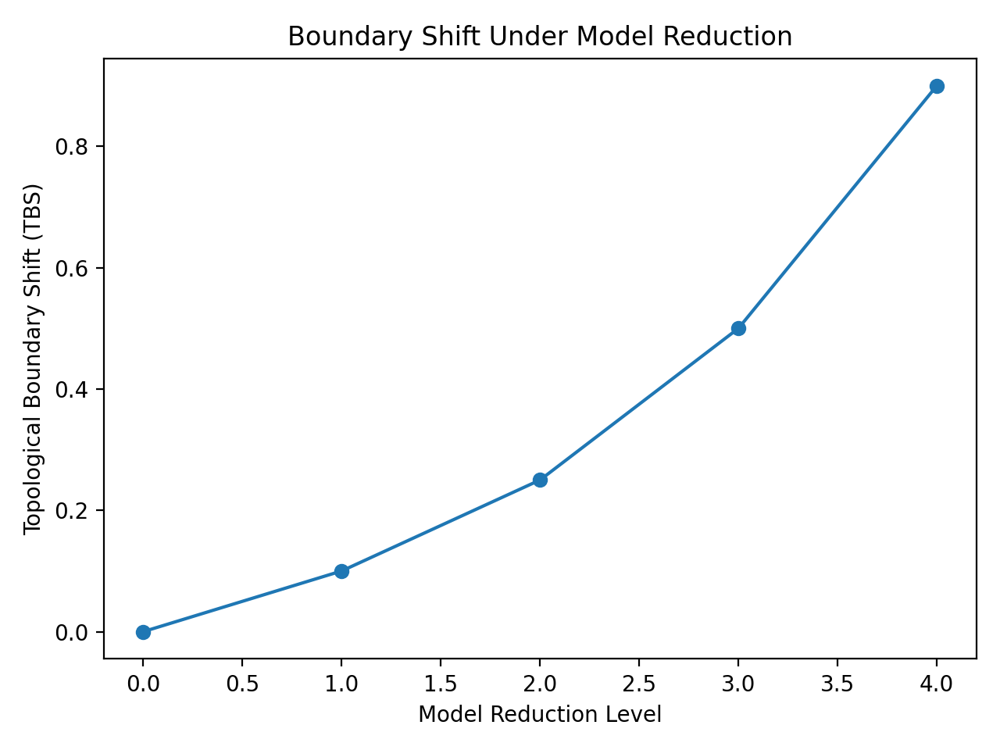

# Boundary Shift under Model Reduction

This figure illustrates how critical regime boundaries can shift under model reduction.

**Definition**
TBS = |K_c(micro) - K_c(reduced)|

**Axes**
- x: reduction level (model abstraction)
- y: boundary shift magnitude

**Interpretation**
Higher abstraction levels may distort regime boundaries.  
This distortion is measured quantitatively by TBS.

**Relation to ARW/ART**
TBS is one of the core distortion metrics used to evaluate cross-scope stability of regime partitions.
