# 2D BC Sweep Cover Height Figures — CASE-0002/0003/0004

Figures produced from 2D BC sweeps run 2026-03-28.
Each case sweeps two boundary conditions simultaneously; cover height analysis
is applied to the flattened grid and visualized as 2D scatter plots and overlays.

Source data:
- `Simulationen/sweep_2d_pendulum.csv` — CASE-0002, 300 points
- `Simulationen/sweep_2d_doppelpendel.csv` — CASE-0003, 308 points
- `Simulationen/sweep_2d_stuart_landau.csv` — CASE-0004, 252 points

Implementation:
- `Simulationen/sweep_2d_all_cases.py` — RK4 sweeps (no scipy)
- `Simulationen/cover_2d_all_cases.py` — cover height analysis + figures

Reference: `docs/advanced/observable_space_cover_height.md`,
`docs/notes/research_journal.md` session 2026-03-28 (II).

---

## CASE-0002 — Pendulum κ × γ

### `cover2d_0002_varrel_panel.png` (sufficient observable)

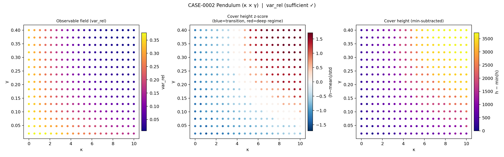

**What it shows:** Three panels for var_rel across the (κ, γ) plane.

- **Left — Observable field:** var_rel decreases from ~0.39 (high κ, high γ) to ~0.005
  (low κ, low γ). The gradient runs diagonally: more damping or less coupling yields
  lower variance.
- **Center — Cover height z-score (RdBu_r):** Blue = near transition, red = deep inside
  regime. The diagonal pattern confirms that regime depth tracks both κ and γ jointly.
- **Right — Cover height min-subtracted:** Absolute variation above minimum.

**DR: 11.9%.** Low because var_rel varies smoothly (near-uniform density in observable
space), not because the scope lacks structure.

---

### `cover2d_0002_varrel_overlay.png`

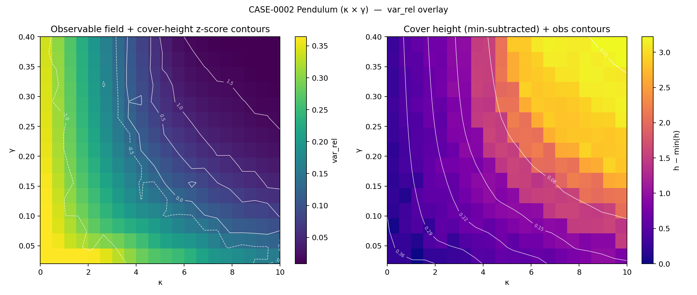

**What it shows:**
- **Left:** var_rel heatmap with cover-height z-score contour lines (white).
  Contours are diagonal in (κ, γ) space, confirming BC interaction.
- **Right:** Cover height field (min-subtracted) with var_rel iso-lines (white).

**Key observation:** Contour lines are not axis-aligned — the regime boundary
is a joint condition on κ and γ, not an independent threshold on each.
This is the empirical signature of BC interaction (see Q_NEW_18).

---

### `cover2d_0002_lambdaproxy_panel.png` (insufficient observable)

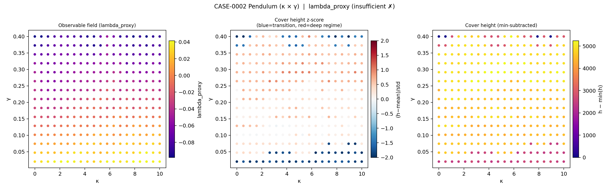

**DR: 17.5%.** Observable field is scattered / noisy across the (κ, γ) plane
with no monotone structure — Pattern B (F0 structural failure). The cover-height
z-score shows patchy, non-monotone structure confirming that high DR here reflects
noise, not regime depth.

---

### `cover2d_0002_lambdaproxy_overlay.png`

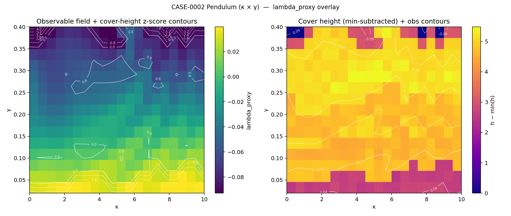

Cover-height contours do not align with observable iso-lines. In contrast to var_rel,
the two fields are decorrelated, consistent with the observable failing to track the
underlying scope structure.

---

## CASE-0003 — Doppelpendel E × m₂

### `cover2d_0003_varrel_panel.png` (sufficient observable)

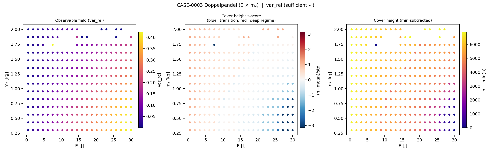

**DR: 23.3%.** var_rel shows a clear gradient from the low-energy regime (E < 5 J)
to the diffusion-dominated regime (E > 15 J). The m₂ axis has a weaker effect,
visible as gentle modulation of the transition position. The z-score panel shows
a gradient from deep incoherent interior (E ≪ E_c, red) toward the transition
boundary (E ≈ E_c, blue).

---

### `cover2d_0003_varrel_overlay.png`

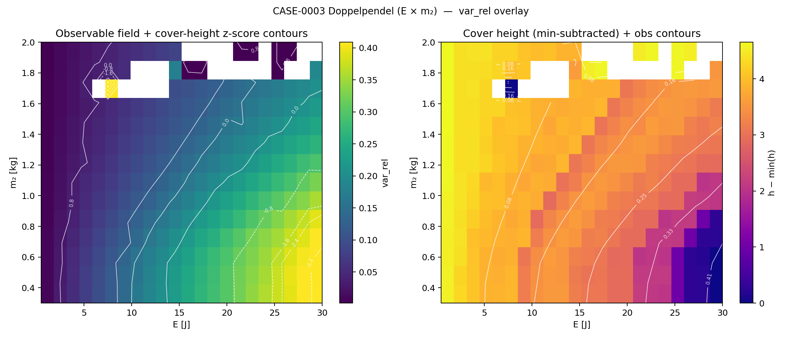

The cover-height contours have a slight diagonal tilt in (E, m₂) space, indicating
weak BC interaction. The primary BC is E (vertical contour lines dominate); m₂
introduces a secondary modulation. This is consistent with m₂ shifting the natural
frequency but E controlling total energy injection and the diffusion threshold.

---

### `cover2d_0003_lambdaproxy_panel.png` (insufficient observable)

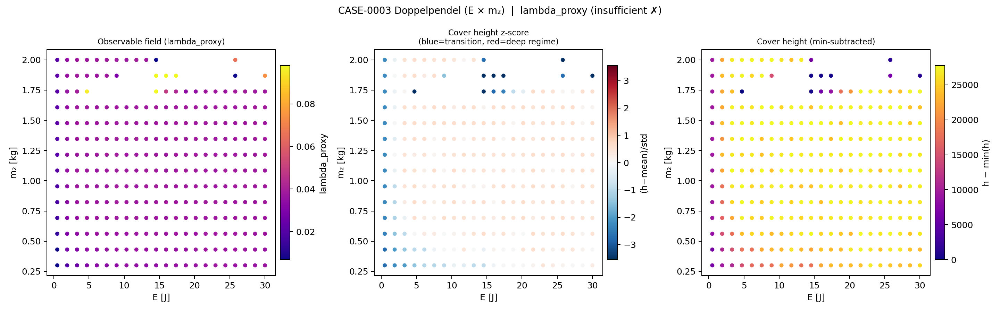

**DR: 89.3%.** Highest DR of all six observables. The observable field is highly
irregular across the (E, m₂) plane with no coherent spatial structure. The z-score
panel is patchy and high-amplitude. This is the clearest example of Pattern B
(F0 failure) in the dataset: DR is elevated by noisy density variation, not by
genuine regime clustering.

---

### `cover2d_0003_lambdaproxy_overlay.png`

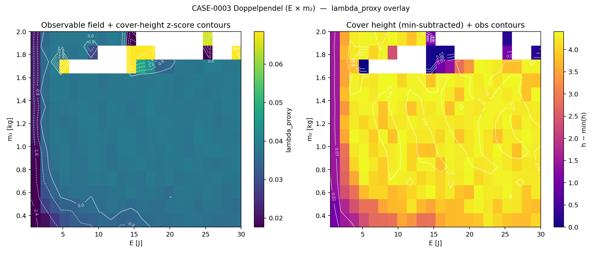

The overlay shows decorrelation between observable iso-lines and cover-height contours,
confirming structural mismatch between the observable and the underlying partition.

---

## CASE-0004 — Stuart-Landau K × λ

### `cover2d_0004_plv_panel.png` (sufficient observable)

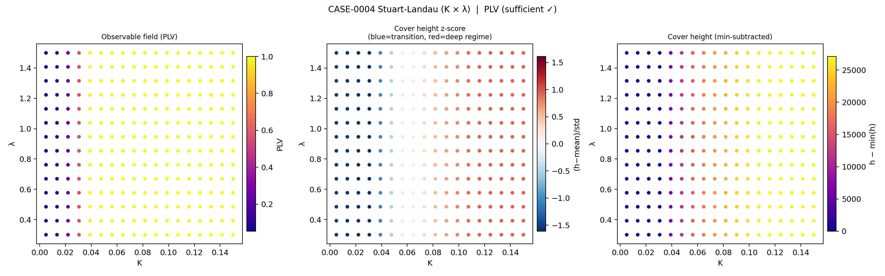

**DR: 136.1%.** PLV shows the clearest structure of all six observables. The observable
field transitions sharply from PLV ≈ 0 (incoherent, low K) to PLV ≈ 1 (phase-locked,
high K), with the transition boundary curving in (K, λ) space. The z-score panel
shows a strong gradient: deep blue near the transition, strong red in the
phase-locked interior. High DR reflects genuine density contrast — the phase-locked
regime is a dense cluster in observable space (PLV → 1 plateau), while the transition
zone is sparse.

---

### `cover2d_0004_plv_overlay.png`

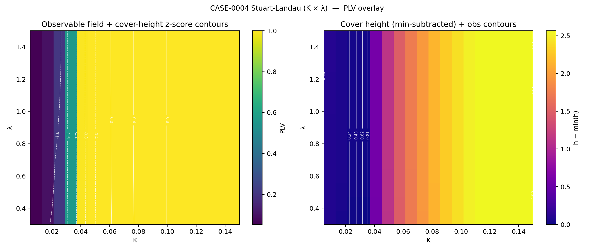

**Key observation:** PLV iso-lines and cover-height contours align closely. The
transition boundary curves from low-K/low-λ to high-K/high-λ, consistent with
the analytical prediction K_c ≈ λ for the Stuart-Landau synchronization threshold.
The 2D sweep resolves this curved boundary that a 1D K-sweep at fixed λ cannot.

---

### `cover2d_0004_ampasym_panel.png` (insufficient observable)

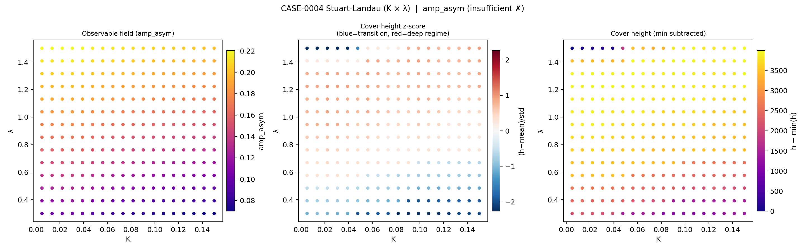

**DR: 14.2%.** amp_asym is near-constant (~0.08) throughout the entire (K, λ) plane.
The observable field and cover-height z-score panels are both flat. This is the
archetypal Pattern C (F1 span failure): the observable simply does not respond to
the BC variation that drives the phase-locking transition. amp_asym collapses before
PLV activates — it is an emergence precursor that has already saturated by the time
the sweep range begins.

---

### `cover2d_0004_ampasym_overlay.png`

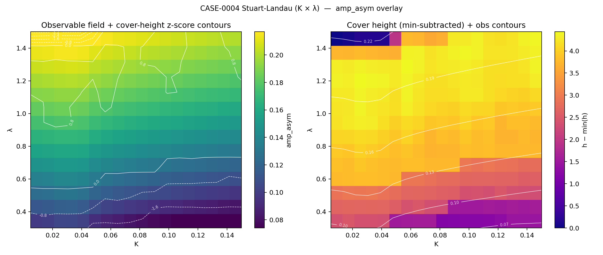

Flat cover height throughout. Observable iso-lines are sparse and approximately
axis-aligned, reflecting the absence of genuine gradient structure in the (K, λ)
plane for this observable.

---

## Cross-Case Summary — `cover2d_dr_comparison.png`

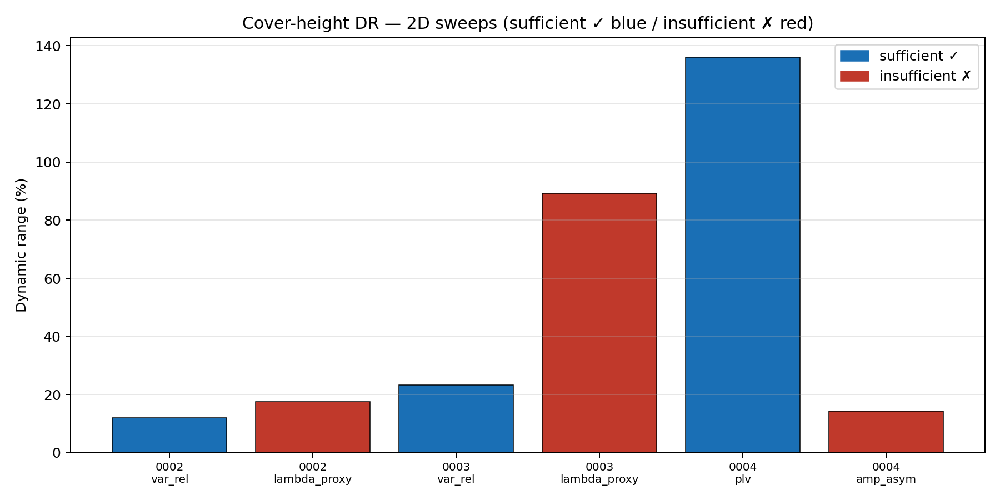

**What it shows:** Dynamic range (%) for all six observables from the 2D sweeps.
Blue bars = sufficient; red bars = insufficient.

**Summary pattern:**

| Case      | Observable     | Class | DR 2D  |
|-----------|----------------|-------|--------|
| CASE-0002 | var_rel        | S     | 11.9%  |
| CASE-0002 | lambda_proxy   | I     | 17.5%  |
| CASE-0003 | var_rel        | S     | 23.3%  |
| CASE-0003 | lambda_proxy   | I     | 89.3%  |
| CASE-0004 | PLV            | S     | 136.1% |
| CASE-0004 | amp_asym       | I     | 14.2%  |

CASE-0004 is the only case where DR alone correctly separates sufficient (S) from
insufficient (I). In CASE-0002/0003, lambda_proxy shows higher DR than var_rel due
to F0 structural failure producing noisy observable-space density, not genuine
regime clustering. Profile shape (smooth vs. patchy) is required to discriminate
Pattern A (true structure) from Pattern B (F0 failure).
