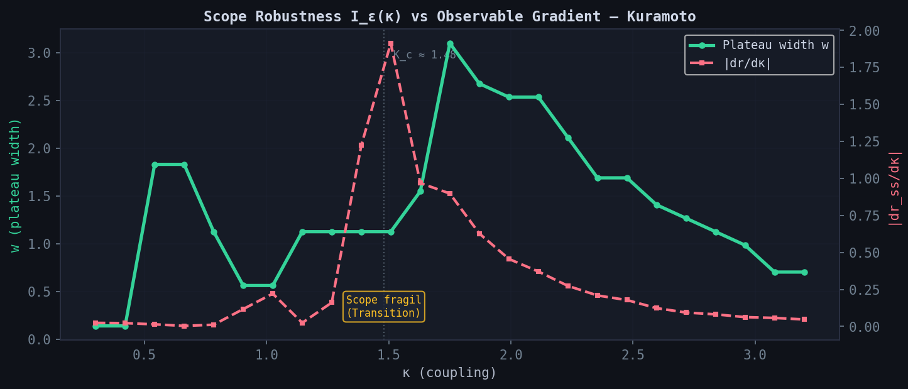

# Scope Robustness I_ε(κ) vs Observable Gradient — Kuramoto

**File:** `figures/epsilon_kappa_robustness.png`
**Case:** CASE-20260311-0001 (Kuramoto, dense 50-point κ-sweep)

## Content

Dual-axis plot showing the local plateau width w(κ) (green, left axis)
and the observable gradient |dr_ss/dκ| (red dashed, right axis) across
the coupling parameter κ.

The vertical dotted line marks K_c ≈ 1.48 (maximum gradient).

## Key result

The scope is least robust near the phase transition. Plateau width w
and observable gradient |dr/dκ| anti-correlate with r = −0.77.

Where the system changes fastest (the transition region), the
admissible ε-interval narrows — ε must be precisely calibrated.
In the deep incoherent (κ < 0.5) and deep synchronized (κ > 2.5)
regimes, the scope is robust and ε choice is forgiving.

## Implication

Scope specifications near phase transitions need tighter ε calibration.
The ε-sweep is most valuable precisely in the regions where the
system is most interesting.
