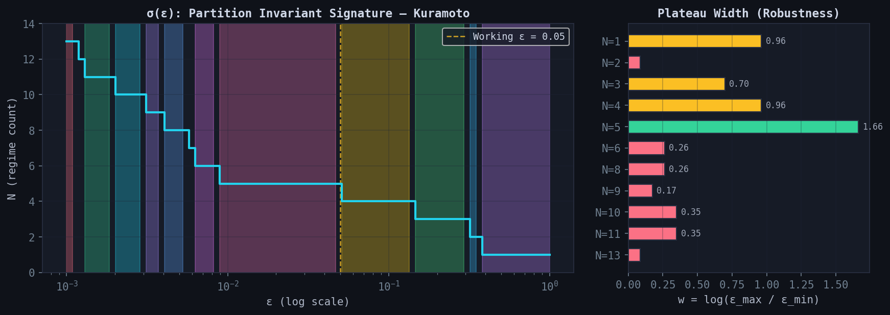

# ε-Sweep: Partition Invariant Signature — Kuramoto

**File:** `figures/epsilon_sweep_kuramoto.png`
**Case:** CASE-20260311-0001 (Kuramoto, N=500, 15 κ-values)

## Left panel: σ(ε) step function

The regime count N as a function of ε (log scale), computed by
ε-clustering on the order parameter r_ss. 80 ε-values in [0.001, 1.0].

Colored bands show the admissible ε-intervals (plateaus) where N is
constant. The dashed yellow line marks the working ε = 0.05, which
sits at the boundary between the N=5 and N=4 plateaus.

## Right panel: Plateau widths

Horizontal bars show w = log(ε_max / ε_min) for each plateau.
Green: robust (w > 1.5). Yellow: moderate (0.5 < w < 1.5). Red: fragile (w < 0.5).

The N=5 plateau (w = 1.66) is the most robust partition structure —
not the expected N=3 partition (w = 0.70).

## Key result

The partition structure is not a modeling choice — it is determined by
the observable landscape and ε. The researcher chooses *which plateau*
(which resolution level) is appropriate for the question at hand.
