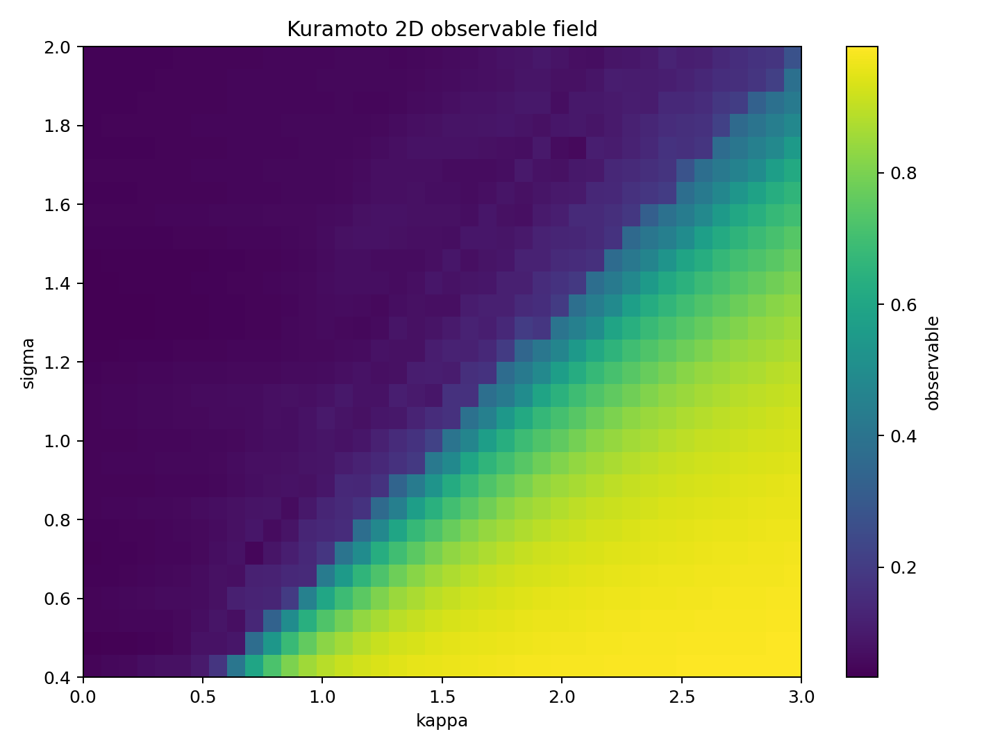
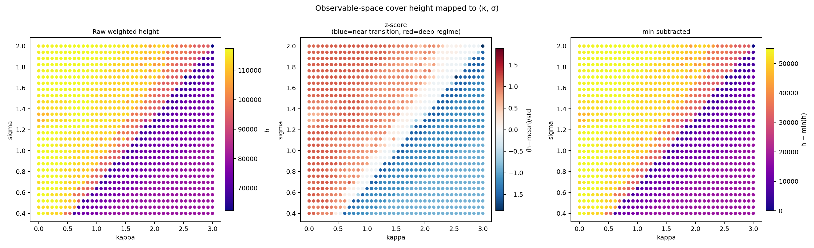
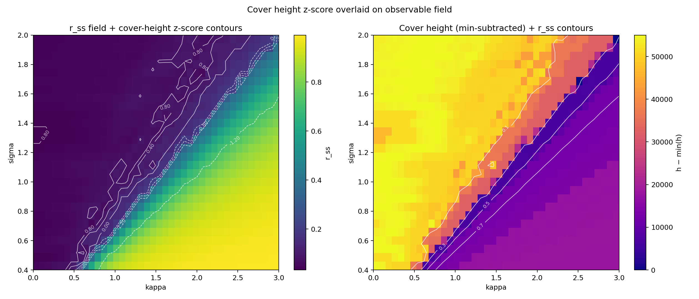
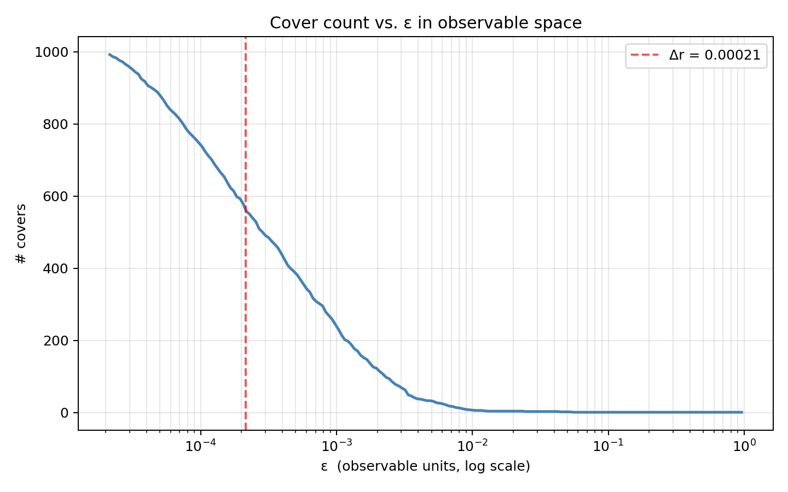
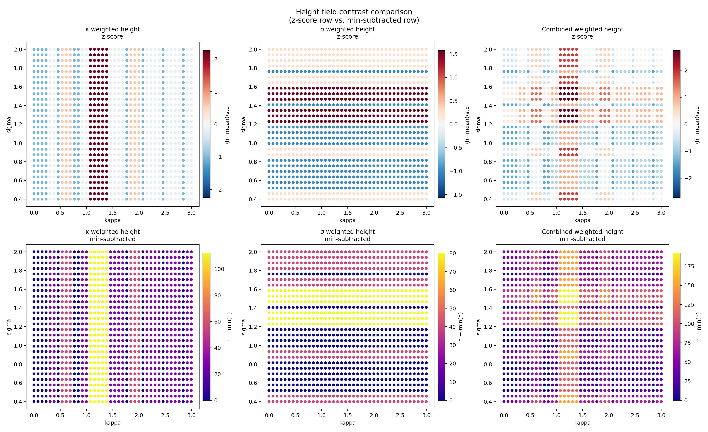

# Kuramoto 2D BC Sweep — Cover Height Figures

Figures produced from the 2D (κ × σ) Kuramoto sweep (session 2026-03-27).
Source data: `Simulationen/kuramoto_2d_sweep.csv` (1120 points).
Method: `Simulationen/cover_observable_space.py`.
Reference doc: `docs/advanced/observable_space_cover_height.md`.

---

## Figure 1 — `kuramoto_2d_observable_heatmap.png`

**What it shows:** The raw observable field r_ss over the (κ, σ) BC grid.
κ ∈ [0, 3] (x-axis), σ ∈ [0.4, 2.0] (y-axis).

**Interpretation:** The diagonal boundary separating the incoherent regime
(r_ss ≈ 0, dark/purple, upper-left) from the synchronized regime
(r_ss → 1, yellow, lower-right) is consistent with the analytical
Kuramoto transition κ_c = 2σ. This is the observable field that
all subsequent cover analyses operate on.

---

## Figure 2 — `obs_space_cover_height_panel.png`

**What it shows:** Three representations of the observable-space cover height
h(κ, σ) mapped back to BC space.

- **Left — Raw h:** absolute accumulated weight. Large DC offset
  (baseline ~96500) compresses apparent variation. Not informative without normalization.
- **Center — z-score:** (h − mean) / std. Full color range used for actual variation.
  Blue = below mean (near transition), red = above mean (deep inside regime).
  Dynamic range: 57%.
- **Right — min-subtracted:** h − min(h). Shows variation from 0 to max range (55023).

**Key feature:** The z-score panel reveals that the height gradient runs
diagonally, parallel to the κ_c = 2σ boundary. Height is highest (red) deep
in the incoherent regime and decreases toward the transition.

---

## Figure 3 — `obs_height_overlay.png`

**What it shows:** Two overlay visualizations combining the observable field
and the cover height.

- **Left:** r_ss heatmap with cover height z-score contour lines overlaid (white).
  The contours run approximately parallel to the regime boundary, confirming that
  h encodes distance from the transition, not regime identity.
- **Right:** Cover height (min-subtracted) as a color field, with r_ss iso-lines
  overlaid (white, at r_ss = 0.1, 0.3, 0.5, 0.7).

**Interpretation:** The near-coincidence of cover-height contours and r_ss
iso-lines shows that in this system, observable-space cover height is
approximately a monotone function of r_ss. For systems with more complex
observable landscapes (e.g. multiple plateaus, non-monotone observables),
the two fields would diverge — which is precisely where cover height adds
information beyond the raw observable.

---

## Figure 4 — `obs_cover_count_curve.png`

**What it shows:** The number of covers as a function of ε (log scale)
in observable space.

**Interpretation:** At small ε (left of the red dashed line marking Δr),
almost every point is its own cover (~1000 covers). As ε increases,
covers merge monotonically. The curve is smooth with no visible steps —
indicating no sharp clustering structure in r_ss space at the scales sampled.
A step in this curve would indicate a gap in the observable distribution,
which could signal a regime boundary or an observable-space discontinuity.

The red dashed line marks Δr ≈ 2.1 × 10⁻⁴ (median step in sorted r_ss),
which defines the lower bound of the ε range.

---

## Figure 5 — `cover_height_contrast_panel.png`

**What it shows:** Comparison of z-score (top row) and min-subtracted (bottom row)
normalization for the three BC-space cover height fields produced by the
original `cover_bc_intervals_weighted.py` (κ-axis, σ-axis, combined).

**Diagnostic value:** Demonstrates that BC-space covers on a uniform grid
produce 2–4% variation with a large absolute offset. The z-score normalization
reveals the residual structure: vertical stripes (κ-covers) and horizontal
stripes (σ-covers) with a combined cross pattern near κ ≈ 1.0–1.5, σ ≈ 1.4.
This residual structure reflects edge effects and cover-size variation near
the grid boundaries — not physically meaningful regime structure.

**Contrast with Figure 2:** Observable-space covers (Figure 2) produce 57%
dynamic range and physically interpretable structure. BC-space covers on
uniform grids are uninformative.
