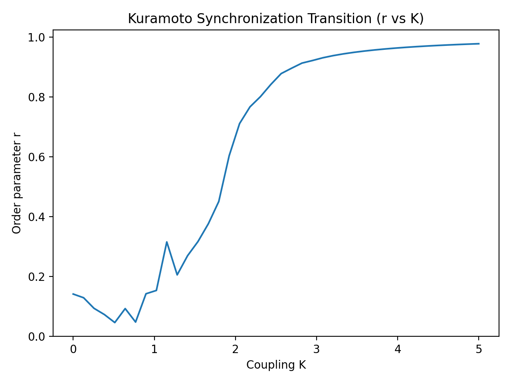

# Kuramoto Synchronization Transition

This figure shows the classical Kuramoto synchronization transition.

**Axes**
- x: coupling strength K
- y: order parameter r = |1/N * sum(exp(i*theta_j))|

**Interpretation**
- Low K: incoherent regime (r ~ 0)
- Around critical K_c: transition region
- High K: synchronized regime (r -> 1)

**Relation to ARW/ART**
The ARW pipeline detects regime partitions along K and evaluates cross-scope distortion metrics such as PCI, RCD, and TBS.
