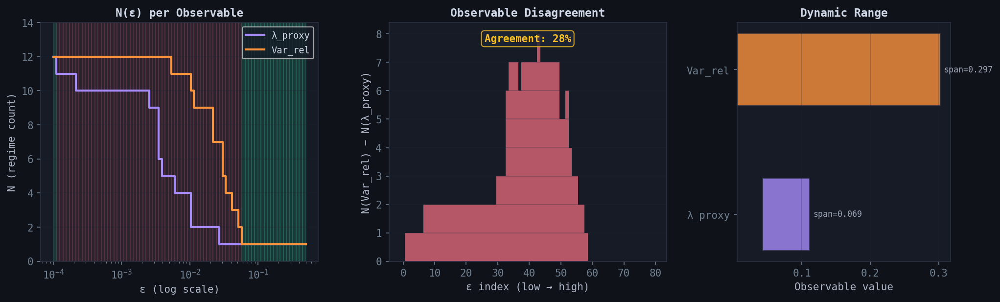

# Multi-Observable Agreement — Double Pendulum

**File:** `figures/multi_observable_agreement.png`
**Case:** CASE-20260311-0003 (Double pendulum, energy sweep, 12 points)

## Three panels

**Left — N(ε) per observable:** Step functions showing the regime count
for λ_proxy (purple) and Var_rel (orange) independently. Green/red
background shading indicates agreement/disagreement zones. λ_proxy
collapses much earlier due to its narrower dynamic range.

**Center — Observable disagreement:** Bar chart showing N(Var_rel) − N(λ_proxy)
at each ε-value. Positive bars (red) indicate that Var_rel resolves more
regimes than λ_proxy. The agreement rate (green bars at zero) is 28%.

**Right — Dynamic range:** Horizontal bars comparing the value spans
of both observables. Var_rel (0.297) has 4.3× the span of λ_proxy (0.069).

## Key result

A single shared ε is insufficient for multi-observable scopes when
observables have different dynamic ranges. The 28% agreement rate shows
that the two observables see fundamentally different structure at most
resolutions.
