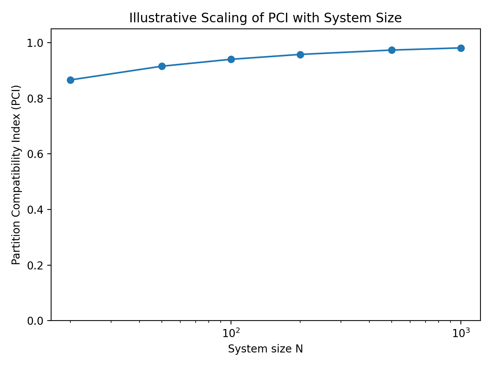

# PCI Scaling with System Size

This figure illustrates how the Partition Compatibility Index (PCI) may scale with system size.

**Axes**
- x: system size N (log scale)
- y: PCI

**Interpretation**
Small systems show stronger fluctuations and lower compatibility.  
As N increases, coarse-grained descriptions align more closely with the micro model, and PCI approaches 1.

**Relation to ARW/ART**
PCI quantifies how well regime partitions are preserved across model reductions or scope transformations.
